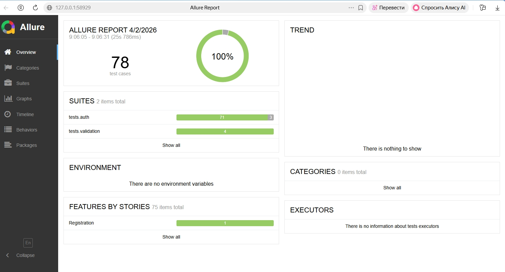
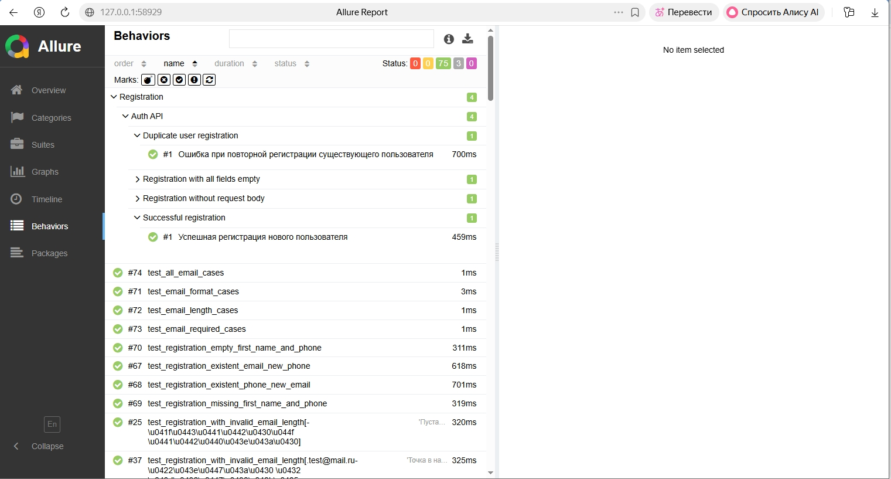
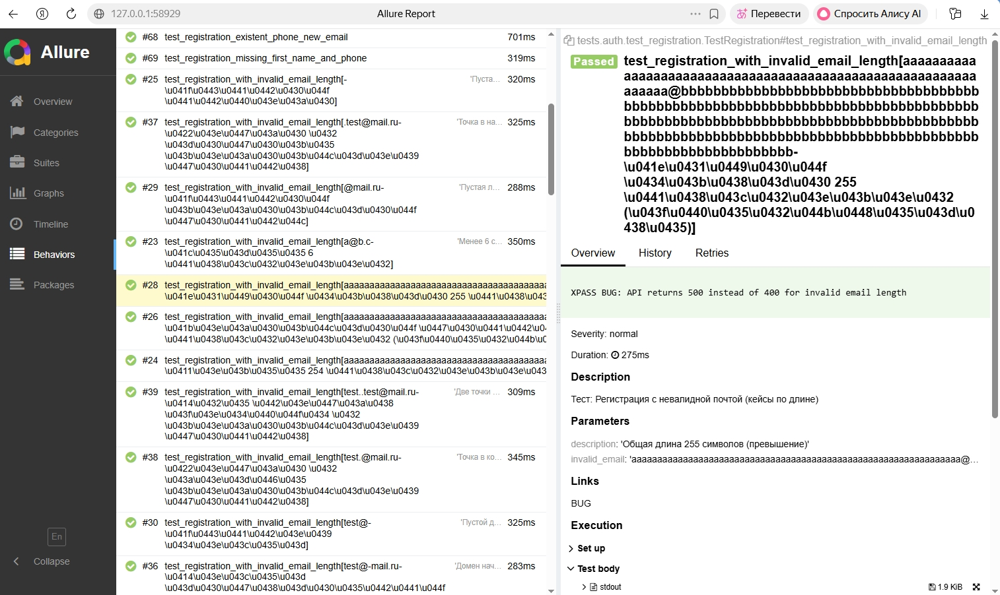

# API Autotests — Registration

    

[](https://imidg1825.github.io/auction-api-test-suite/) [](https://github.com/imidg1825/auction-api-test-suite/actions)

Кнопка OPEN ALLURE REPORT открывает актуальный отчет с результатами тестирования.  
Кнопка RUN TESTS переводит в GitHub Actions, где можно запустить новый прогон тестов (Run workflow).

В проекте реализовано 78 автотестов, покрывающих ключевые бизнес-сценарии регистрации пользователей (позитивные, негативные и граничные кейсы).

Набор автотестов для эндпоинта **регистрации пользователей** (`POST /api/registration/`). Проект разработан для **внутреннего тестирования API** продуктового стенда аукциона; фронт тестового контура: [https://front.test.kp.ktsf.ru/](https://front.test.kp.ktsf.ru/).

Тесты используются, чтобы подтверждать **корректность регистрации пользователей** (успешные сценарии и ожидаемые отказы) и **валидацию данных** на стороне API — согласованность статусов, структуры ошибок и сообщений по полям `email`, `first_name`, `phone_number`.

Проект включает дымовые и регрессионные проверки, покрывая основные сценарии регистрации: позитивные, граничные и негативные кейсы.

**Зачем это нужно:** быстро ловить расхождения контракта API с ожиданиями (статусы, структура ошибок, валидация), не поднимая ручные прогоны Postman на каждый релиз.

---

## Стек технологий 🛠

- **Python** — язык и рантайм тестов  
- **pytest** — запуск, параметризация, маркеры (`xfail` и др.)  
- **requests** — HTTP-вызовы API  
- **allure-pytest** — отчёты Allure (эпики, фичи, шаги, вложения)  
- **python-dotenv / config** — окружение и базовый URL (см. `config/`)
- **Docker** — запуск тестов в изолированном контейнере
- **GitHub Actions** — CI/CD: автоматический запуск тестов при каждом push и pull request

---

## Структура проекта 📁

| Путь | Назначение |
|------|------------|
| `tests/` | Тесты: `auth/` (регистрация), `validation/` (локальный `EmailValidator`) |
| `data/` | Фабрики пользователей, тест-кейсы, хелперы, тексты ошибок |
| `services/` | Клиенты API (`auth_service`), сервисы валидации email |
| `config/` | Настройки подключения к API (например, `BASE_URL`, таймауты) |
| `bugs/` | Оформленные баг-репорты в Markdown и правила их именования |
| `utils/` | Вспомогательный код |
| `requirements.txt` | Зависимости Python |

Корневой `.gitignore` исключает `venv/`, кэши pytest, каталоги Allure и артефакты IDE.

---

## Установка ⚙

### 1. Виртуальное окружение

```bash
python -m venv venv
```

**Windows (PowerShell):**

```powershell
.\venv\Scripts\Activate.ps1
```

**Linux / macOS:**

```bash
source venv/bin/activate
```

### 2. Зависимости

```bash
pip install -r requirements.txt
```

Убедитесь, что в `config`/`.env` задан корректный **URL стенда** под ваши прогоны.

---

## Запуск тестов ▶

Из корня проекта (с активированным `venv`):

```bash
python -m pytest tests -v --ignore=venv
```

Точечный запуск, например только регистрация:

```bash
python -m pytest tests/auth/test_registration.py -v
```

---

## Allure: сбор результатов и отчёт 📊

1. **Прогон с выгрузкой сырья для Allure:**

```bash
python -m pytest tests --ignore=venv --alluredir=allure-results
```

2. **Просмотр отчёта** (нужен установленный [Allure Commandline](https://github.com/allure-framework/allure2)):

```bash
allure serve allure-results
```

Артефакты `allure-results/` и сгенерированный `allure-report/` обычно не коммитятся (см. `.gitignore`).

## Docker 🐳

Проект можно запускать в контейнере Docker для обеспечения воспроизводимого окружения и независимости от локальной настройки системы.

Команды:

```bash
docker build -t a-ads-autotests .
```

```bash
docker run --rm a-ads-autotests
```

## CI / GitHub Actions ⚙

В проекте настроен CI через GitHub Actions.

При каждом push и pull request:
- автоматически устанавливаются зависимости
- запускаются все автотесты (pytest)
- проверяется стабильность API

Это позволяет:
- быстро выявлять ошибки
- гарантировать, что тесты всегда проходят
- поддерживать качество проекта на стабильном уровне

Allure-отчёт автоматически публикуется через GitHub Pages.

## Allure отчёт 📊

Актуальный отчёт по автотестам доступен по ссылке:

https://imidg1825.github.io/auction-api-test-suite/


## Пример отчёта Allure 📸

Ниже приведены примеры отчёта Allure с результатами автотестов.

### Общий обзор отчёта



### Раздел Behaviors (структура тестов)



### Детали теста и BUG-ссылка



---

## Описание тестов 🧪

### Позитивные сценарии

- Успешная регистрация нового пользователя (**201 Created**)  
- Проверка ключевых полей в ответе согласно отправленным данным  

### Негативные сценарии

- Дубликаты по email / телефону (ожидаемые **4xx** и согласованное тело ошибки)  
- Пустые / неполные тела, отсутствие обязательных полей  
- Невалидный формат и длина `email`, `first_name`, `phone_number` (часть кейсов параметризована)  

### Валидация (локально)

- `tests/validation/` — проверки **`EmailValidator`** отдельно от API (формат, длина, обязательность)

---

## Баги 🐛

Известные дефекты API описаны в папке bugs/.

В Allure у части тестов есть **ссылки `BUG`** на соответствующие идентификаторы / темы багов (см. тесты с `xfail` и `@allure.link`).

---

## Дополнительно: `xfail` и известные баги API ⚠

Часть тестов помечена **`@pytest.mark.xfail`**: по ним API **ещё** ведёт себя не по ожидаемому контракту (например, **500** вместо **400** на части кейсов длины email, или **201** при спорном `first_name`). Такие прогоны не «зелёные по ошибке»: pytest учитывает их как ожидаемые отклонения до фикса бэкенда.

После исправления API маркеры `xfail` убираются, тесты становятся обычными **PASSED**.

---

*Если что-то не сходится со стендом — сначала проверьте `BASE_URL`, доступность API и актуальность ветки с тестами.*

## Автор

**Иван Мазницын** — QA Engineer
